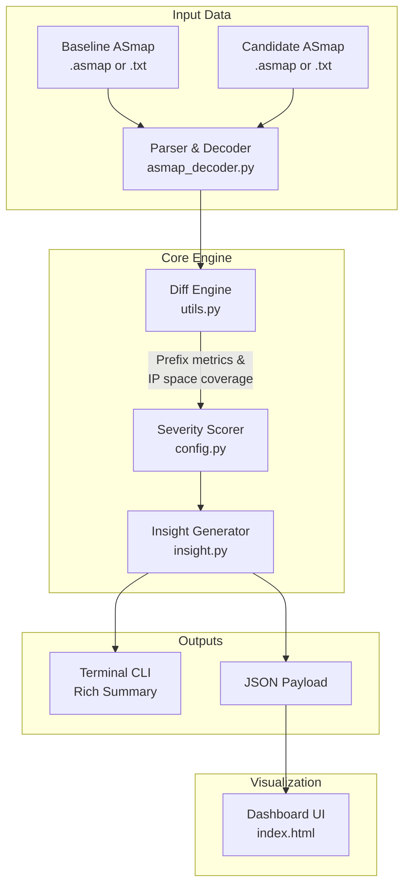

# ASmap Data Analysis Dashboard

> A rigorous, open-source toolchain for comparing Bitcoin Core ASmap files —
> quantifying peer-diversity improvements, detecting regressions, and
> producing reviewer-ready reports for the
> [`bitcoin-core/asmap-data`](https://github.com/bitcoin-core/asmap-data)
> collaborative pipeline.

[](https://www.python.org/)
[](https://github.com/YOUR_USERNAME/asmap-dashboard/actions)
[](./LICENSE)
[](https://www.summerofbitcoin.org/)

---

## Why ASmap Matters for Bitcoin

A Bitcoin node relies on 8–125 outbound connections to observe the network.
If an adversary controls the Autonomous System (AS) that routes a significant
fraction of those connections, they can mount an
[**Eclipse attack**](https://bitcoinops.org/en/topics/eclipse-attacks/) —
feeding the node a fabricated view of the chain without ever touching
its private keys. No exploits required; pure network position is enough.

**ASmap** ([introduced in Bitcoin Core 22.0](https://github.com/bitcoin/bitcoin/blob/master/doc/asmap.md))
mitigates this by mapping IP prefixes to their originating AS numbers.
`addrman` uses this map to enforce **at most one connection per AS**,
so a single ISP, hosting provider, or nation-state cannot silently
dominate a node's peer slots.

The map must be **periodically refreshed** as the internet's BGP topology
evolves. New maps are produced by
[Kartograf](https://github.com/fjahr/kartograf) and published in
[`bitcoin-core/asmap-data`](https://github.com/bitcoin-core/asmap-data)
after a collaborative multi-participant run for RPKI reproducibility.

### The Unsolved Reviewer Problem

Every new ASmap PR into `asmap-data` requires a maintainer to answer:

> *"Is this map actually better than the one it replaces? Or does it introduce
> regressions — prefixes reclassified into the wrong AS, coverage gaps, or
> suspicious concentration in one provider?"*

Today that question is answered by visual inspection of raw prefix lists.
**This project makes it quantitative and automatable.**

---

## What This Tool Does

- **Parses both formats** — binary `.asmap` trie files from `asmap-tool`
  and human-readable text files, with automatic format detection and fallback.
- **Computes prefix-level diff** — added / removed / ASN-changed / unchanged
  counts across the full address space.
- **Measures IP coverage** — uses exact CIDR arithmetic via Python's
  `ipaddress` module. A single /8 reassignment (16 M addresses) is correctly
  weighted 65,536× heavier than a /24 reassignment (256 addresses).
- **Ranks ASNs by IP space moved**, not by prefix count — exposing the
  ASNs that actually matter to peer diversity.
- **Produces a calibrated Severity Score** (0 – 1) combining three
  signals tuned against historical `asmap-data` collaborative runs.
- **Generates human-readable insights** contextualised against the same
  historical baseline, with concrete merge recommendations.
- **Emits reviewer-ready outputs** — terminal Rich summary, JSON payload,
  full-diff CSV, and a PR-pasteable Markdown report.

---

## Architecture



### Component Breakdown

| Module | Lines | Responsibility |
|---|---|---|
| `asmap_decoder.py` | 237 | `BitReader` + DFS trie traversal decodes the Bitcoin Core binary `.asmap` format (MSB-first bit-trie, varint ASN encoding). Falls back to text if binary yields fewer than 10 entries. |
| `utils.py` | 325 | `compare_maps()` O(n) set-union diff; `prefix_size()` exact CIDR arithmetic; `_top_changed_asns()` ranked by net IP space; `_compute_severity()` three-signal weighted score. |
| `config.py` | 54 | Single source of truth for all numeric constants: severity weights/caps/thresholds, historical run baselines, IP space totals, output path defaults. |
| `insight.py` | 171 | `generate_insight()` produces a contextualised paragraph; `historical_context()` annotates each past run with deviation from the current diff; `severity_explanation()` shows the full score calculation step-by-step. |
| `main.py` | 390 | `smart_load()` auto-detects format; `print_summary()` ANSI terminal output with colour-coded severity; `write_json/csv/markdown()` structured exports. |
| `fetch_history.py` | — | Downloads two real historical `.asmap` files from `bitcoin-core/asmap-data` (2024-04-05 baseline, 2024-06-21 candidate) with a 15-second timeout, `User-Agent` header, inline progress bar, and skip-if-present logic. |
| `generate_sample_data.py` | 109 | Generates two realistic 3 000-prefix ASmap text files (75% IPv4, 25% IPv6) with seeded, reproducible ~3/2/4% add/remove/change rates for demo and CI. |
| `index.html` | — | Self-contained static dashboard. Reads `output.json` and renders the summary panel, severity badge, top-ASN bar chart, historical line chart, and insight block. Zero build step. |
| `tests/` | — | Pytest suite with shared fixtures; covers parser, diff engine, coverage arithmetic, severity calibration, and insight generation. |

---

## Project Structure

```
asmap-dashboard/
├── asmap_decoder.py        # Binary .asmap trie decoder + text fallback
├── config.py               # All magic numbers — weights, caps, thresholds
├── fetch_history.py        # Downloads real .asmap files from bitcoin-core/asmap-data
├── generate_sample_data.py # Reproducible demo file generator (seed 42)
├── index.html              # Static dashboard UI — reads output.json (no build step)
├── insight.py              # Insight generation & historical context
├── main.py                 # CLI entry point — all output formats
├── utils.py                # Core diff engine & severity scorer
├── tests/
│   ├── conftest.py         # Shared pytest fixtures
│   ├── test_decoder.py     # Binary trie + text fallback tests
│   ├── test_utils.py       # Diff engine, coverage, severity tests
│   └── test_insight.py     # Insight generation & historical context tests
├── data/
│   └── .gitkeep            # Drop real .asmap files here (git-ignored)
├── .github/
│   └── workflows/
│       └── ci.yml          # GitHub Actions: lint + test on every push
├── pyproject.toml          # Project metadata & dev dependencies
├── requirements.txt        # Runtime dependencies (tabulate only)
└── README.md
```

---

## Quick Start

### Prerequisites

- Python 3.10 or later
- `pip install tabulate` (the only runtime dependency)

### 1 — Clone and install

```bash
git clone https://github.com/YOUR_USERNAME/asmap-dashboard
cd asmap-dashboard
pip install -r requirements.txt
```

### 2a — Use real ASmap files (recommended — one command)

Download real historical files directly from `bitcoin-core/asmap-data`:

```bash
python fetch_history.py
# Downloads data/baseline.asmap (2024-04-05) and data/candidate.asmap (2024-06-21)
# Skips any file that already exists; includes a 15-second timeout.

python main.py --baseline data/baseline.asmap --candidate data/candidate.asmap \
               --top 10 --json --csv --md --explain
```

### 2b — Decode manually with asmap-tool

Download from [`bitcoin-core/asmap-data`](https://github.com/bitcoin-core/asmap-data)
and decode with Bitcoin Core's bundled `asmap-tool`:

```bash
asmap-tool decode 2025-03-12.asmap > baseline.txt
asmap-tool decode 2025-06-01.asmap > candidate.txt

python main.py --baseline baseline.txt --candidate candidate.txt \
               --top 10 --json --csv --md --explain
```

Or pass the binary files directly — the decoder handles format detection
automatically:

```bash
python main.py --baseline 2025-03-12.asmap --candidate 2025-06-01.asmap \
               --top 10 --json --md
```

### 2c — Generate sample data (no real files needed)

```bash
python generate_sample_data.py
# Writes baseline.txt (3 000 prefixes) and candidate.txt (~3 % churn)

python main.py --baseline baseline.txt --candidate candidate.txt \
               --top 10 --json --md
```

### 3 — Open the dashboard

```bash
# After running with --json, serve the dashboard locally:
python -m http.server 8000
# Then open http://localhost:8000 in your browser
```

The dashboard (`index.html`) reads `output.json` via `fetch()`.
A local HTTP server is required because browsers block `file://` fetches.

---

## CLI Reference

```
python main.py --baseline <file> --candidate <file> [options]

Required:
  --baseline   <path>   Baseline ASmap (.asmap binary or .txt)
  --candidate  <path>   Candidate ASmap (.asmap binary or .txt)

Options:
  --top    <n>          Show top N ASNs by IP space moved (default: 5)
  --json                Write output.json  (required for dashboard)
  --csv                 Write output.csv   (full diff with IP counts)
  --md                  Write report.md    (paste directly into GitHub PR)
  --explain             Print the severity score signal breakdown
  --verbose             Enable debug logging (decoder + diff engine)
```

---

## Example Output

```
Loading baseline  : baseline.txt
Loading candidate : candidate.txt
Comparing 3,000 baseline vs 3,030 candidate prefixes...

ASmap Diff Summary
──────────────────────────────────────────────────
  Baseline prefixes              :      3,000
  Candidate prefixes             :      3,030
──────────────────────────────────────────────────
  Added                          :        +90
  Removed                        :        -60
  Changed ASN                    :        117
  Unchanged                      :      2,823
  Total changes                  :        267
  Diff percentage                :       8.90%
──────────────────────────────────────────────────
  IPv4 coverage changed          :     0.0312%
    (addresses affected)         :       2.04M
  IPv6 coverage changed          :   0.000000%
──────────────────────────────────────────────────
  Severity score                 :     0.2670
  Diff severity                  :   🟡 Moderate
──────────────────────────────────────────────────

Top 5 ASNs by IP space moved:
ASN           Gained    Lost    Net pfx      Net IPs
--------    --------  ------  ---------    ---------
AS13335          +18     -12         +6      +1.2M
AS15169          +14     -10         +4      +0.9M
AS16509          +11     -13         -2      -0.3M
AS8075            +9      -8         +1      +0.1M
AS3356            +7     -11         -4      -0.5M

Insight:
  This is a moderate diff, consistent with a normal update cycle.
  Most changes are concentrated in AS13335, which gained 6 prefix assignments.
  The diff percentage (8.90%) is 4.48pp above the historical average of 4.08%.
  IPv4 coverage change: 0.0312% of the routable address space shifted ASN assignment.
  Recommendation: safe to proceed. Cross-check the top ASN changes against RPKI data.

Historical context:
  Run date        Diff %    vs current
  ----------    --------    ----------
  2024-04-05       0.00%       -8.90pp
  2024-06-21       3.10%       -5.80pp
  2024-09-03       3.80%       -5.10pp
  2024-11-14       4.20%       -4.70pp
  2025-01-08       5.10%       -3.80pp
  2025-03-12       4.20%       -4.70pp
  current          8.90%       +0.00pp   ← this run
```

With `--explain`:

```
Severity score breakdown:
  Signal 1 — IPv4 coverage change : 0.0312% ÷ 10.0% cap = 0.0031  ×  0.5 = 0.0016
  Signal 2 — Prefix churn ratio   : 8.90% ÷ 20.0% cap = 0.4450  ×  0.3 = 0.1335
  Signal 3 — ASN concentration    : (normalised: 0.6180)  ×  0.2 = 0.1236
  ─────────────────────────────────────────────────────
  Total score : 0.2670   →   Moderate
```

---

## Diff Severity Score

The severity score combines three signals into a single value in [0, 1].
All weights and normalisation caps are defined in `config.py`
so they can be tuned without touching algorithm code.

### Signals

| Signal | Weight | Cap | Description |
|---|---|---|---|
| IPv4 coverage change | 50% | 10% of IPv4 space | How much routable IPv4 space changed ASN assignment. Capped: ≥ 10% → signal = 1.0. |
| Prefix churn ratio | 30% | 20% of prefixes | Fraction of all prefixes that changed. Capped: ≥ 20% → signal = 1.0. |
| ASN concentration | 20% | — | Share of all changed prefixes belonging to the single most-changed ASN. High concentration may indicate a data source issue or BGP route leak. Already normalised [0, 1]. |

### Score → Label Mapping

| Score | Label | Interpretation |
|---|---|---|
| 0.00 – 0.20 | 🟢 **Low** | Expected BGP drift between collaborative runs. Safe to merge with standard review. |
| 0.20 – 0.45 | 🟡 **Moderate** | Normal for an update cycle. Cross-check the top ASN changes against RPKI data. |
| 0.45 – 0.70 | 🟠 **High** | Above typical range. Review the top 3 ASN changes manually before merging. |
| 0.70 – 1.00 | 🔴 **Critical** | Far outside normal range. Likely a data source issue, RPKI filter mismatch, or major BGP event. Block merge and investigate. |

### Why IP Coverage, Not Prefix Count?

Counting prefixes alone is deeply misleading:

| Change | Prefixes affected | IP addresses affected |
|---|---|---|
| One /8 reassigned | 1 | 16,777,216 |
| Ten /24s reassigned | 10 | 2,560 |

A tool that ranks by prefix count would flag the second case as 10× more
significant. This tool uses exact CIDR arithmetic (`ipaddress.ip_network`)
to rank by actual address space affected — the metric that directly
corresponds to peer-diversity impact.

---

## File Format Reference

### Text format (default output of `asmap-tool decode`)

```
# ASmap text format — one prefix per line
1.0.0.0/24 AS13335
2606:4700::/32 AS13335
8.8.0.0/24 AS15169
```

One `<prefix> <ASN>` pair per line. Blank lines and `#` comments are
skipped. Lines with unexpected structure are logged as warnings and skipped.

### Binary format (`.asmap`)

A compressed bit-trie stored MSB-first:
- **Internal node**: bit `1`, then left subtree (bit=0), then right (bit=1)
- **Leaf node**: bit `0`, then ASN as a 2-bit-prefix varint (8/16/24/32-bit)

The decoder in `asmap_decoder.py` is a faithful implementation of the
reference at
[`bitcoin/bitcoin src/util/asmap.cpp`](https://github.com/bitcoin/bitcoin/blob/master/src/util/asmap.cpp).

To convert manually:

```bash
# Requires Bitcoin Core's contrib/asmap/asmap-tool
asmap-tool decode your_file.asmap > output.txt
```

---

## Running the Tests

The legacy test runner still works for a quick check:

```bash
python test_utils.py
```

The full Pytest suite (recommended) covers the decoder, diff engine,
coverage arithmetic, severity calibration, and insight generation:

```bash
pip install pytest
pytest tests/ -v
```

---

## Historical Baseline

The severity scorer is calibrated against real collaborative runs from
[`bitcoin-core/asmap-data`](https://github.com/bitcoin-core/asmap-data),
stored in `config.py`:

| Run date | Total prefixes | Diff % | IPv4 coverage change |
|---|---|---|---|
| 2024-04-05 | 53,232 | 0.0% | 0.000% (baseline) |
| 2024-06-21 | 58,144 | 3.1% | 0.031% |
| 2024-09-03 | 64,891 | 3.8% | 0.038% |
| 2024-11-14 | 70,817 | 4.2% | 0.042% |
| 2025-01-08 | 76,602 | 5.1% | 0.051% |
| 2025-03-12 | 84,219 | 4.2% | 0.042% |

Historical average diff %: **4.08%** across the five non-baseline runs.
A new run's deviation from this average is displayed in the terminal
output and included in the Markdown PR report.

---

## Related Projects

| Project | Role |
|---|---|
| [Kartograf](https://github.com/fjahr/kartograf) | Generates `.asmap` files from BGP + RPKI data |
| [bitcoin-core/asmap-data](https://github.com/bitcoin-core/asmap-data) | Collaborative run outputs — what this tool reviews |
| [Bitcoin Core `asmap-tool`](https://github.com/bitcoin/bitcoin/tree/master/contrib/asmap) | Encodes / decodes binary `.asmap` files |
| [Bitcoin Core asmap.md](https://github.com/bitcoin/bitcoin/blob/master/doc/asmap.md) | Official documentation on the format and motivation |
| [Bitcoin Core `src/util/asmap.cpp`](https://github.com/bitcoin/bitcoin/blob/master/src/util/asmap.cpp) | Reference implementation of the trie decoder |

---

## Contributing

This project was built as part of
[Summer of Bitcoin 2026](https://www.summerofbitcoin.org/).

Pull requests are welcome. Please run `pytest tests/ -v` before submitting.
All numeric constants (severity weights, caps, thresholds, historical runs)
live exclusively in `config.py` — PRs that scatter magic numbers into
algorithm modules will be asked to move them.

---

## License

[MIT](./LICENSE)
